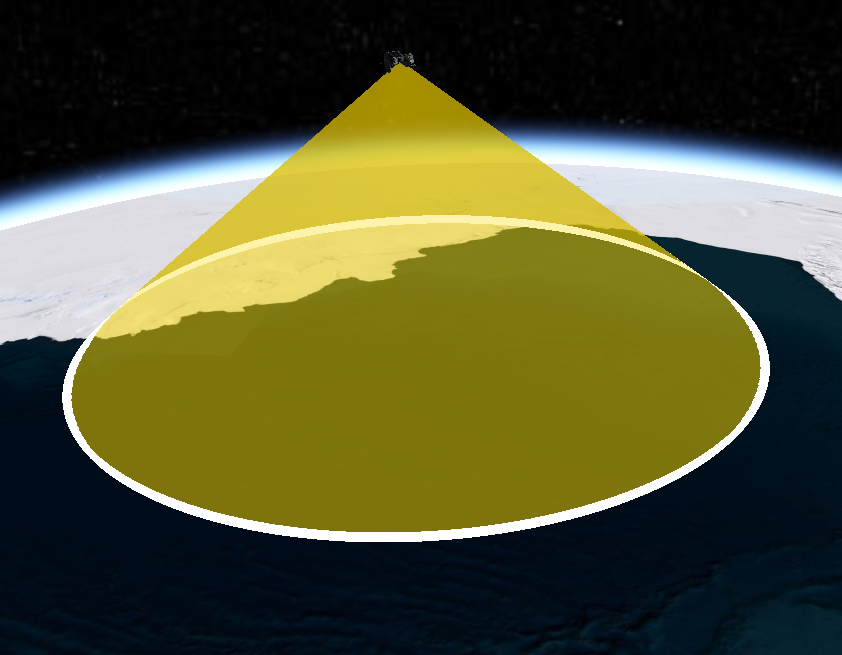
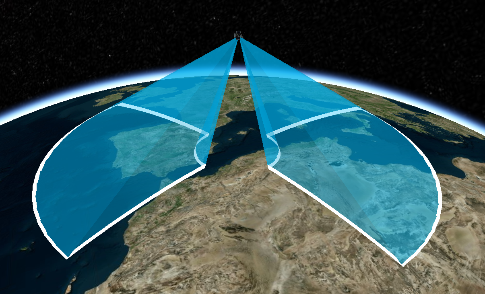
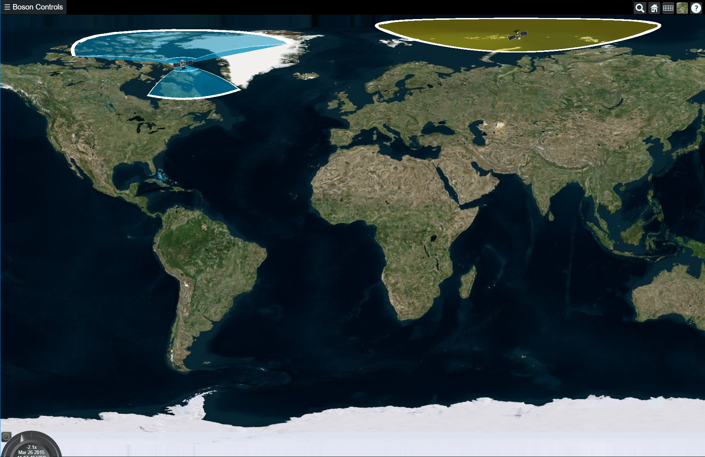

<p align="center">
<a href="http://cesium.agi.com/">

</a>
</p>

# Cesium Sensor Volumes
> A Cesium plugin for visualizing sensor volumes in both 3D and 2D projections.

**Version**: Built for *Cesium >= 1.62*. For versions < 1.62 use the `1.59` branch

**License**: Apache 2.0.  Free for commercial and non-commercial use.  See [LICENSE.md](LICENSE.md).

**Usage**

Prebuilt minified and unminified versions of the plugin are in the [Build](Build/) directory.  Include the `CesiumSensors.js` file using a `script` tag after the `Cesium.js` `script` tag.

The plugin automatically adds support for the CZML properties `agi_conicSensor`, `agi_customPatternSensor`, and `agi_rectangularSensor`.  The corresponding `Entity` properties are `conicSensor`, `customPatternSensor`, and `rectangularSensor`.

In order to load data directly into `Entity` objects that you create directly, you must call `entity.addProperty` to create each of the sensor properties you wish to use.  The CZML processing does this automatically.

```html
<script src="path/to/Cesium.js"></script>
<script src="path/to/CesiumSensors.js"></script>
<script>
// To create an entity directly
var entityCollection = new Cesium.EntityCollection();

var entity = entityCollection.getOrCreateEntity('test');
entity.addProperty('conicSensor');

// configure other entity properties, e.g. position and orientation...

entity.conicSensor = new CesiumSensors.ConicSensorGraphics();
entity.conicSensor.intersectionColor = new Cesium.ConstantProperty(new Cesium.Color(0.1, 0.2, 0.3, 0.4));
</script>
```
# Examples

Simple examples are included in the [Examples](Examples/) folder.  To run locally, run `npm install`, then run `node server.js` and navigate to [http://localhost:8080](http://localhost:8080) and select the example application to run.

#### Conic Sensor
```javascript
export function create_conic_sensor(entity, inner_half_angle, outer_half_angle, color){
  entity.addProperty('conicSensor');
  const sensor = entity.conicSensor = new CesiumSensors.ConicSensorGraphics();
  sensor.innerHalfAngle = Cesium.Math.toRadians(inner_half_angle);
  sensor.outerHalfAngle = Cesium.Math.toRadians(outer_half_angle);
  sensor.lateralSurfaceMaterial = new Cesium.ColorMaterialProperty(color.withAlpha(.5));
  sensor.radius = 5500000;
  sensor.show = true;
  sensor.intersectionWidth = 10;
  entity.ellipsoid = new Cesium.EllipsoidGraphics({
    radii: new Cesium.Cartesian3(5500000, 5500000, 5500000),
    maximumCone: Cesium.Math.toRadians(outer_half_angle),
    material: color.withAlpha(.5),
    outline: new Cesium.ConstantProperty(true),
    show: false
  });

}
```



#### Custom Sensor
```javascript
export function create_squint_sensor(entity, min_clock, max_clock, min_angle, max_angle, color){
  entity.addProperty('customPatternSensor');
  const sensor = entity.customPatternSensor = new CesiumSensors.CustomPatternSensorGraphics();

  const NUM_POINTS = 16;
  const LINE_POINTS = 8;
  function mix(min, max, t){
    return min * (1 - t) + max * t;
  }

  const angle_delta = max_clock - min_clock;

  const directions = [];
  for (var i = 0; i <= 1; i += 1 / (NUM_POINTS-1)) {
		const clock = Cesium.Math.toRadians(mix(min_clock, max_clock, i));
		const cone = Cesium.Math.toRadians(min_angle);
    directions.push(new Cesium.Spherical(clock, cone));
	}

  for(var i = 0; i <= 1; i += 1 / (LINE_POINTS-1)){
    const clock = Cesium.Math.toRadians(max_clock);
		const cone = Cesium.Math.toRadians(mix(min_angle, max_angle, i));
    directions.push(new Cesium.Spherical(clock, cone));
  }

  for(var i = 0; i <= 1; i += 1 / (NUM_POINTS-1)){
    const clock = Cesium.Math.toRadians(mix(max_clock, min_clock, i));
		const cone = Cesium.Math.toRadians(max_angle);
    directions.push(new Cesium.Spherical(clock, cone));
  }

  for(var i = 0; i <= 1; i += 1 / (LINE_POINTS-1)){
    const clock = Cesium.Math.toRadians(min_clock);
		const cone = Cesium.Math.toRadians(mix(max_angle, min_angle, i));
    directions.push(new Cesium.Spherical(clock, cone));
  }

  //Essentially makes a cut in the shape of the sensor volume
  directions.push(null);    //This only works with modified fork of cesium-volume-sensors

  for (var i = 0; i <= 1; i += 1 / (NUM_POINTS-1)) {
		const clock = Cesium.Math.toRadians(mix(min_clock, max_clock, i));
		const cone = Cesium.Math.toRadians(min_angle);
    directions.push(new Cesium.Spherical(clock + Math.PI, cone));
	}

  for(var i = 0; i <= 1; i += 1 / (LINE_POINTS-1)){
    const clock = Cesium.Math.toRadians(max_clock);
		const cone = Cesium.Math.toRadians(mix(min_angle, max_angle, i));
    directions.push(new Cesium.Spherical(clock + Math.PI, cone));
  }

  for(var i = 0; i <= 1; i += 1 / (NUM_POINTS-1)){
    const clock = Cesium.Math.toRadians(mix(max_clock, min_clock, i));
		const cone = Cesium.Math.toRadians(max_angle);
    directions.push(new Cesium.Spherical(clock + Math.PI, cone));
  }

  for(var i = 0; i <= 1; i += 1 / (LINE_POINTS-1)){
    const clock = Cesium.Math.toRadians(min_clock);
		const cone = Cesium.Math.toRadians(mix(max_angle, min_angle, i));
    directions.push(new Cesium.Spherical(clock + Math.PI, cone));
  }

  sensor.directions = directions;
  sensor.radius = 5500000;
  sensor.lateralSurfaceMaterial = new Cesium.ColorMaterialProperty(color.withAlpha(.5));
  sensor.intersectionWidth = 10;

}
```



# 2D Projection Capabilities
This fork modified the sensor volume webgl shader to correctly project in 2D scene view.



>Note only supports Equirectangular 2D map projection

### Vertex Shader
Only the [vertex shader](https://github.com/MathDotSqrt/cesium-sensor-volumes/blob/master/Source/CustomSensorVolumeVS.glsl) has been updated to support 2D projections.

```glsl
...
void main(){
  vec4 world_pos = czm_model * position;

  //if position intersects the earth, project position onto surface
  //of the ellipsoid.
  //Slight performance boost because fragment shader will have to cull
  //fewer pixels.
  //This also aids with the accuracy of the 2d projection
  vec3 projected_world_pos = projectPointOnEllipsoid(world_pos.xyz);

  //computes position with respect to cesium's scene mode 3d, 2d,
  //columbus, and morph
  vec3 scene_wc = computeScenePosition(projected_world_pos);

  //final screen space position
  gl_Position = czm_viewProjection * vec4(scene_wc, 1.);

  ...
}
```
[Ellipsoid point projection](http://www.ambrsoft.com/TrigoCalc/Sphere/SpherLineIntersection_.htm) is an optimization for the 3D view and reduces distortion for the equirectangular projection.

```glsl
const float EARTH_RADIUS_MAX = 6378137.;			//max radius of the earth
const float EARTH_RADIUS_MIN = 6356752.314; 	//min radius of the earth
...
vec3 projectPointOnEllipsoid(vec3 world_pos){
	vec3 sensor_origin_wc = czm_model[3].xyz / czm_model[3].w;

	//http://www.ambrsoft.com/TrigoCalc/Sphere/SpherLineIntersection_.htm
	vec3 slope = world_pos - sensor_origin_wc;
	float a = dot(slope, slope);
	float b = -2. * dot(slope, -sensor_origin_wc);
	float c = dot(sensor_origin_wc, sensor_origin_wc) - EARTH_RADIUS_MIN * EARTH_RADIUS_MIN;

	float discriminant = b * b - 4. * a * c;
	float sqrt_discriminant = sqrt(discriminant);
	float t1 = (-b + sqrt_discriminant) / (2. * a);
	float t2 = (-b - sqrt_discriminant) / (2. * a);
	float t = min(t1, t2);

	vec3 projected_point = sensor_origin_wc + slope * t;

	//bool is_not_sensor_origin = a > .001;
	bool is_intersecting = discriminant > 0.;
	return is_intersecting && (t > 0.) ? projected_point : world_pos;
}
```

If scene mode is 3D no-op. If scene mode is 2D perform equirectangular projection.
```glsl
vec3 computeScenePosition(vec3 world_pos){
	if(czm_sceneMode == czm_sceneMode3D){
		return world_pos;
	}

	//sceneMode: 2D, Columbus position
	vec3 projected_pos = computeEquirectangular(world_pos);
  ...
}
```

Equirectangular Projection
```glsl
const float EARTH_RADIUS_MAX = 6378137.;			//max radius of the earth
...
vec3 computeEquirectangular(vec3 world_pos){
	//converts earth centered earth fixed coordinates to
	//geodetic altitude, longitude, latitude
	vec3 all = ecef2all(world_pos);
	float alt = all.x;
	float lon = all.y;
	float lat = all.z;

	//longitude normally has range of -pi, +pi
	//but if sensor is at the edge of the 2d scene mapProjection
	//parts of the sensor will tear
	lon = wrapLon(lon);

	//actual equirectangular projection
	//TODO perform mercator projection as an option
	vec3 projection = vec3(alt, lon * EARTH_RADIUS_MAX, lat * EARTH_RADIUS_MAX);

	return projection;
}
```
[`ecef2all`](https://www.mathworks.com/matlabcentral/fileexchange/7941-convert-cartesian-ecef-coordinates-to-lat-lon-alt) converts cartesian coordinates to altitude, longitude and latitude

``` glsl
vec3 ecef2all(vec3 ecef){
	const float a = EARTH_RADIUS_MAX;
	const float a2 = a * a;

	const float e = 8.1819190842622E-2;
	const float e2 = e * e;

	const float b = sqrt(a2*(1.-e2));
	const float b2 = b * b;
	const float ep = sqrt((a2 - b2) / b2);
	const float ep2 = ep * ep;

	float p = sqrt(ecef.x * ecef.x + ecef.y * ecef.y);
	float th = atan(a * ecef.z, b * p);

	float sin_th = sin(th);
	float sin_th3 = sin_th * sin_th * sin_th;
	float cos_th = cos(th);
	float cos_th3 = cos_th * cos_th * cos_th;

	float lon = atan(ecef.y, ecef.x);
	float lat = atan(ecef.z + ep2 * b * sin_th3, p - e2 * a * cos_th3);

	float sin_lat = sin(lat);
	float sin_lat2 = sin_lat * sin_lat;
	float N = a / sqrt(1. - e2 * sin_lat2);

	float alt = p / cos(lat) - N;

	return vec3(alt, lon, lat);
}
```


### Build
To build, run `npm install`, then run `node build.js`.
